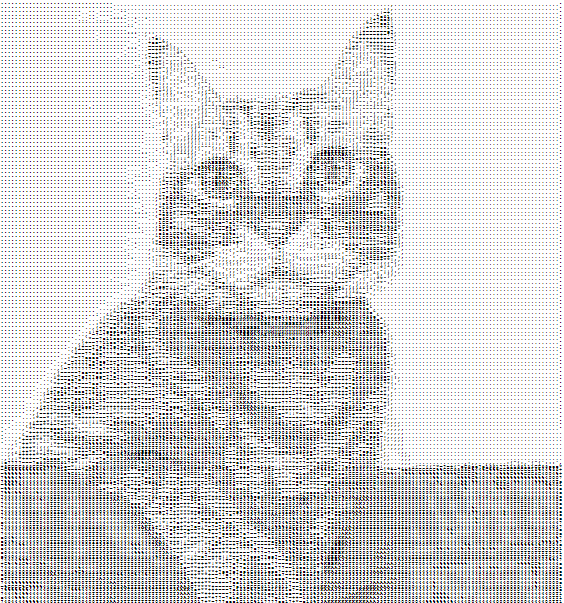

# Image to ASCII Art Converter

This project is a software tool that converts image files to ASCII art. The software receives an image file path, a collection of ASCII characters for the conversion, and the desired resolution for the output. The converted ASCII art can be printed to the console or saved as an HTML file. Additionally, a user interface is provided for ease of use.

## Features

- **Image to ASCII Conversion**: Converts any image file to ASCII art using a specified set of ASCII characters.
- **Custom Resolution**: Allows setting the desired resolution for the ASCII art output.
- **Output Options**: Print the ASCII art directly to the console or save it as an HTML file.
- **User Interface**: A user-friendly interface for easy interaction with the software.

## Requirements

- Java Development Kit (JDK) 8 or higher

## Example

    
    

